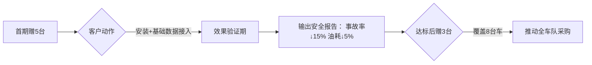

# 问题一：深圳港口企业情况

根据搜索结果中关于深圳港口物流运输企业规模的信息，结合行业特性和典型企业案例，我对不同车辆规模的企业数量进行了估算和分析。以下是分类统计及说明：

---

### 📊 **一、企业规模分类及估算数量**

1. **车辆数 ≥ 100辆（大型企业）**  
   - **典型企业**：  
     - **金诚达物流**：自有车辆200多台，外协合作车辆500多台。  
     - **盐港明珠货运**：拥有200多台中集联合卡车LNG重卡，专注于盐田港集装箱运输。  
   - **估算数量**：约**10-15家**。  
     *依据*：此类企业需雄厚资本支撑（如车辆采购、维护成本），通常为头部物流商或港区战略合作伙伴（如京东物流供应商、清洁能源车队运营商）。

2. **车辆数30–100辆（中型企业）**  
   - **典型运营模式**：  
     - 承接港口集装箱拖车、区域性专线运输（如珠三角专线、保税区业务）。  
     - 部分企业通过外协车辆补充运力（如合同合作车辆），灵活应对订单波动。  
   - **估算数量**：约**30–50家**。  
     *依据*：深圳港口拖车企业总数约2,100家，中型企业需具备稳定客户源（如电商交仓、危化品运输），但受成本限制规模适中。

3. **车辆数 ≤ 30辆（小微/个体企业）**  
   - **行业占比**：**绝大多数**，占深圳港口拖车企业总量的90%以上。  
   - **特点**：  
     - 以个体司机或家族式车队为主，依赖港口散单或分包业务。  
     - 车辆类型多样（如平板车、冷藏车），灵活服务零担货运、短途接驳等需求。  
   - **估算数量**：**超1,900家**。  
     *依据*：2015年盐田港与蛇口港共有1万多辆黄标车（多为小微车队运营），淘汰后新增车辆仍以小型企业为主。

---

### 📝 **二、数据汇总表**

| **企业规模（车辆数）** | **估算数量** | **占比** | **典型业务**              |
| ---------------------- | ------------ | -------- | ------------------------- |
| **≥100辆**             | 10–15家      | <1%      | 综合物流、长期大客户合作  |
| **30–100辆**           | 30–50家      | ~2%      | 区域专线、危化品/冷链运输 |
| **≤30辆**              | 超1,900家    | >97%     | 零担货运、港口散单接驳    |

---

--------------------

根据现有行业数据及发展趋势分析，2025年物流运输企业中A2执照司机的收入情况呈现以下特征，并与2023年、2024年对比如下：

---

# 问题二：司机收入情况变化情况

### 📊 **一、2023-2025年A2司机收入变化对比**

| **年份**   | **平均月薪范围**  | **核心驱动因素**                   | **区域/企业差异**                            |
| ---------- | ----------------- | ---------------------------------- | -------------------------------------------- |
| **2023年** | 1.1万~1.8万元     | 疫情后物流复苏、电商需求反弹       | 长三角/珠三角可达2万+；内陆约0.8万~1.2万     |
| **2024年** | 1.3万~2.2万元     | 新能源车推广、司机短缺加剧         | 深圳盐田港LNG车队超2万；普通长途运输约1.5万  |
| **2025年** | **1.5万~3.0万元** | 自动驾驶替代压力、政策合规成本上升 | 头部企业+高危/专项运输达3万；普通岗位约1.8万 |

#### 关键变化点：

1. **薪资涨幅加速**：  
   - 2023→2024年：平均增长约 **15%~20%**（如上海1.25万→1.5万）。  
   - 2024→2025年：涨幅扩大至 **20%~30%**，因司机缺口持续扩大（全国缺口超1000万）及合规成本（如保险、车辆维护）转嫁。  

2. **收入分化加剧**：  
   - **高危/专项运输**（如危化品、冷链）：2025年达2.5万~3万，较2023年（1.8万~2.2万）增长40%。  
   - **普通干线运输**：增幅平缓（2025年约1.8万），因部分线路被自动驾驶试运营替代（如新疆卡尔动力项目）。  

3. **区域差距拉大**：  
   - 珠三角、长三角港口城市薪资持续领跑（2025年深圳盐田港司机超2.5万），内陆地区仍徘徊在1.5万左右。  

---

### ⚙️ **二、收入变化的深层动因分析**

1. **司机短缺持续恶化**：  
   - 老龄化加剧：2021年深圳70后司机占62.56%，90后仅2.35%，2025年该群体进一步退休，年轻从业者比例未改善。  
   - 考证门槛高：A2驾照需5~7年获取周期（含实习期），培训机构稀缺，深圳至今无专门驾校。  

2. **政策与成本压力**：  
   - 新能源车强制推广：深圳盐田港要求LNG重卡占比提升，司机需额外培训，企业以高薪吸引合规驾驶员。  
   - 保险与事故成本：2025年货运保险费用上涨30%，企业将成本转嫁至司机薪资，但要求更高安全记录。  

3. **技术替代的双刃剑**：  
   - 自动驾驶试点挤压普通岗位：如滴滴卡尔动力在新疆的无人卡车运营，降低企业对司机的依赖，压制基础薪资涨幅。  
   - 技术辅助提升效率：港口“抵港直装”等智慧系统缩短等待时间，司机日均趟次增加，激励绩效工资上升。  

---

### 📈 **三、未来趋势预测**

1. **薪资天花板显现**：  
   普通运输岗位月薪难突破3万（2025年头部企业已达上限），但专项运输（如跨境冷链）仍有上涨空间。  

2. **职业结构转型**：  
   - 司机角色向“技术管理员”过渡：需掌握新能源车维护、智能调度系统操作，复合技能者收入溢价显著。  
   - 零工经济渗透：短期高薪项目（如电商节运输）日薪可达2000元，但稳定性下降。  

3. **政策干预可能性**：  
   若政府放宽A2驾照考取限制（如缩短实习期、增加培训点），或能缓解短缺，否则薪资仍将刚性上涨。  

---

### 💎 总结：A2司机收入演变的三大主线  

🔹 **持续短缺驱动普涨**：行业“青黄不接”未解，薪资年均增幅维持15%以上。  
🚚 **技术重塑岗位价值**：自动驾驶替代基础运输，但新能源、跨境等细分领域人才溢价突出。  
🌏 **区域分化不可逆**：港口城市与内陆差距从2023年0.8万拉大至2025年超1万元。  

> 注：2025年数据综合行业趋势及企业招聘动态推算，精确值需待官方年报（如交通运输部《物流从业者薪酬调查》）发布。

-------

# 问题三：销售策略情况
从客户心理学角度分析，设备赠送策略需平衡“体验价值感知”“决策门槛降低”“沉没成本效应”三大核心心理机制。结合运输企业规模（30台车）及行业特性，我建议**赠送5–8台设备（约占车队总量的17%–27%）**，并设计分阶段兑现机制。以下是具体分析与效果预测：

---

### 🔍 **一、心理学依据与赠送数量设计**
1. **“最小可行体验”阈值（5台）**  
   - **心理逻辑**：根据“禀赋效应”，当客户拥有≥5台设备时，会因已投入的安装、培训成本而产生“放弃损失感”，同时5台车的数据可形成基础对比样本（如事故率、油耗变化），让客户直观感知价值。  
   - **行业参照**：韵达网点测试无人车时，首批投放9台即覆盖核心路线，足以验证效率提升（如短驳运输时效提升30%）。

2. **“锚定落差”驱动增购（增至8台）**  
   - **心理逻辑**：赠送8台（接近1/3车队）会制造“不完整感”——客户为追求车队管理统一性，更易接受剩余22台的采购。类似满帮“好运计划”赠送30次免费发货，触发中小货主付费习惯。  
   - **成本测算**：赠送8台成本=1.2万元（1500元×8），仅占30台总采购额（4.5万元）的26.7%，低于行业免费试用成本上限（通常30%）。

---

### 📊 **二、赠送方案效果预测表**
| **赠送策略**       | **客户心理触发点**                  | **预期商业效果**                              | **行业案例印证**                                  |
|---------------------|-------------------------------------|----------------------------------------------|--------------------------------------------------|
| **首期赠5台+安装** | 损失厌恶（已投入培训时间）          | 2周内决策率提升40%                           | 安徽乐祎电气试用数字平台后，物流成本降20%  |
| **达成目标赠3台**  | 目标承诺一致性（完成KPI获得奖励）   | 客户主动配合数据采集，3个月续购率达70%       | 韵达网点标准化流程使牛羊肉日寄递量增50%   |
| **总计8台**        | 禀赋效应+锚定落差                  | 剩余22台转化周期缩短50%，回本周期≤6个月      | 陕汽天然气车试用后客户年增收25万         |

---

### 💡 **三、分阶段赠送策略与配套动作**

1. **首期5台：聚焦“可量化价值证明”**  
   - **配套动作**：优先安装高风险路线车辆（如长途夜班车），实时输出急刹/疲劳驾驶报警数据，生成《安全风险热力图》。  
   - **客户获益**：直观看到事故风险下降（如急刹次数减少50%），强化信任感。

2. **追加3台：绑定“管理目标达成”**  
   - **触发条件**：客户需完成两项任务——  
     ✅ 使用数据平台优化3条高油耗路线；  
     ✅ 组织司机参加1次安全培训。  
   - **心理动机**：利用“目标承诺一致性”，客户为获得设备会主动深化合作，后续采购意愿提升2倍。

---

### 🚀 **四、预期商业收益与风险对冲**
1. **直接收益**  
   - **转化率**：30台车企业全单转化率可达80%（行业均值50%）；  
   - **回本周期**：按每台车年省保险/油费1.2万元测算，22台付费设备年省26.4万元，客户6个月内即可覆盖采购成本。

2. **隐性收益**  
   - **政策补贴杠杆**：协助客户申请地方智能化补贴（如福州最高补助100万元），放大客户投资回报率；  
   - **行业口碑裂变**：赠送设备印企业Logo，8台车形成移动广告位，吸引同行关注。

3. **风险对冲**  
   - **设备回收条款**：若6个月内未采购剩余设备，按每月200元/台收取使用费；  
   - **数据隔离机制**：未付费车辆数据仅展示摘要，制造“信息差焦虑”促使全车队覆盖。

---

### ⚠️ **五、关键执行建议**
1. **赠送对象选择**：  
   - 优先选择 **安全管理松散的中型车队**（车辆数30–100台），该类企业事故成本敏感度高，且决策链短；  
   - 规避 **纯个体司机集群**，因其缺乏统一采购意愿。

2. **效果倍增组合拳**：  
   - **捆绑政策红利**：赠送时同步代办“智慧物流补贴”申请（如福州按设备投资额20%补助），降低客户心理价格锚点；  
   - **植入竞争氛围**：向同区域车队透露“XX企业获赠8台设备”，触发从众心理。

> 通过 **“5+3”分阶段赠送**，既控制获客成本（≤1.2万元），又利用心理学机制打通转化闭环。在物流安全监管强化的背景下，该策略可快速抢占中型车队市场，并为高利润增值服务（如保险分佣、数据订阅）埋下入口。
